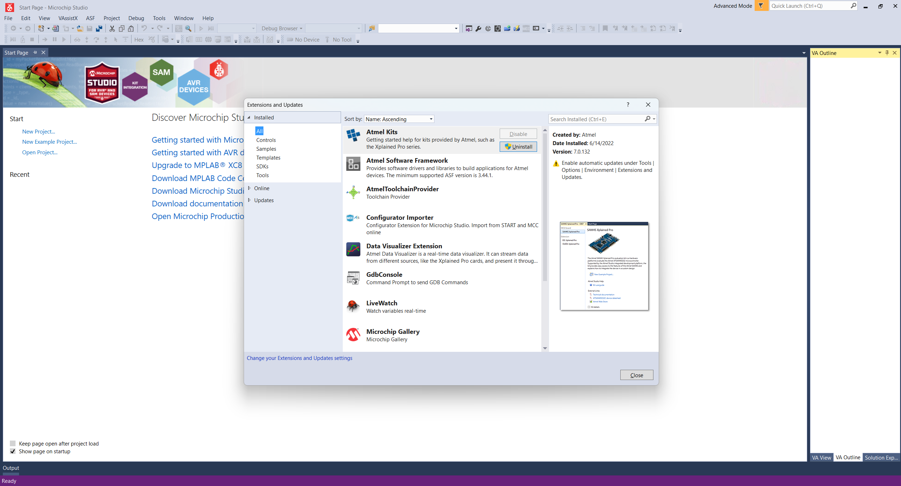
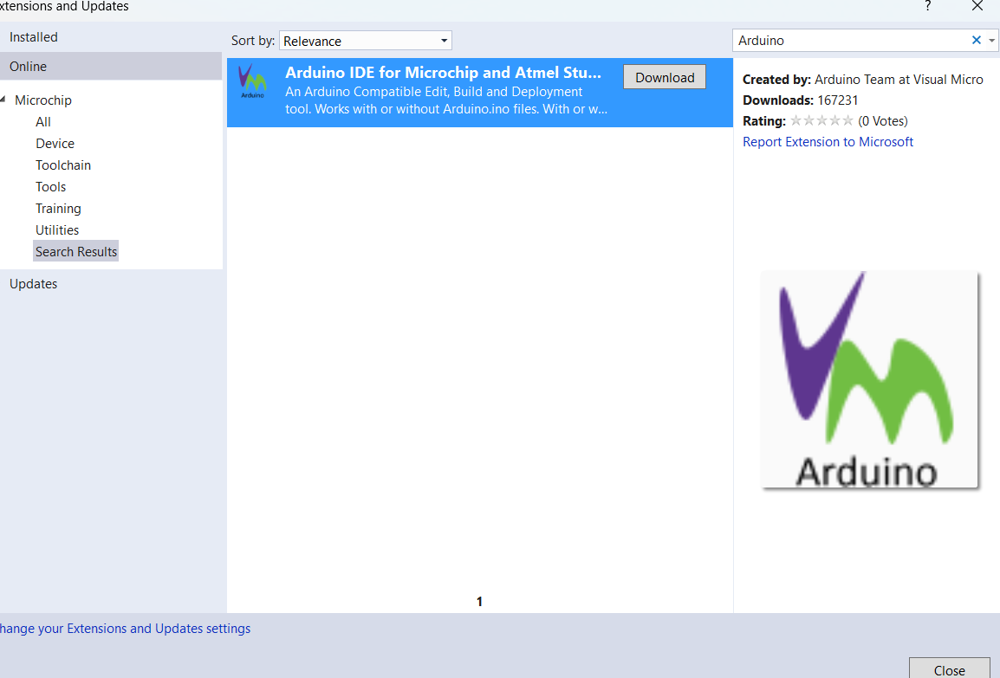

# FACULTY OF ELECTRONICS
# COMPUTER ENGINEERING AND TELECOMMUNICATIONS DEPARTMENT

# HOMEWORK #1
# SETTING UP DEVELOPMENT ENVIRONMENT

Student: Mark  
Teacher: Darius Guršnys

Vilnius, 2024

---

## Table of Contents

1. Description of the steps

---

## 1. Description of the steps

### 1. Download Microchip Studio:

I visited the official Microchip website to download Microchip Studio (formerly known as Atmel Studio).

### 2. Install Microchip Studio:

I launched the downloaded installer and  followed all the installation prompts. During the installation process, I accepted the license agreement and selected the default installation settings, which include all the necessary components for microcontroller development.

The installation process took several minutes to complete, during which all required files and components were installed on my system.

### 3. Download and install VisualMicro Plugin:

After successfully installing Microchip Studio, I proceeded to install the VisualMicro plugin to enable Arduino development capabilities within the IDE.

I navigated to the Tools menu in Microchip Studio and selected "Extensions and Updates" to access the extension manager.

I searched for and located the VisualMicro extension in the available extensions list. This plugin enables seamless Arduino sketch development, compilation, and debugging within the professional Microchip Studio environment.

After installing the VisualMicro extension, I restarted Microchip Studio to ensure the plugin was properly activated and integrated into the development environment.

