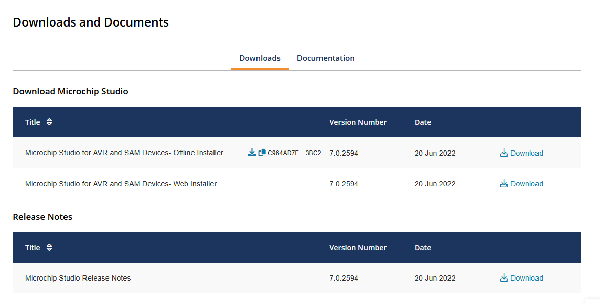
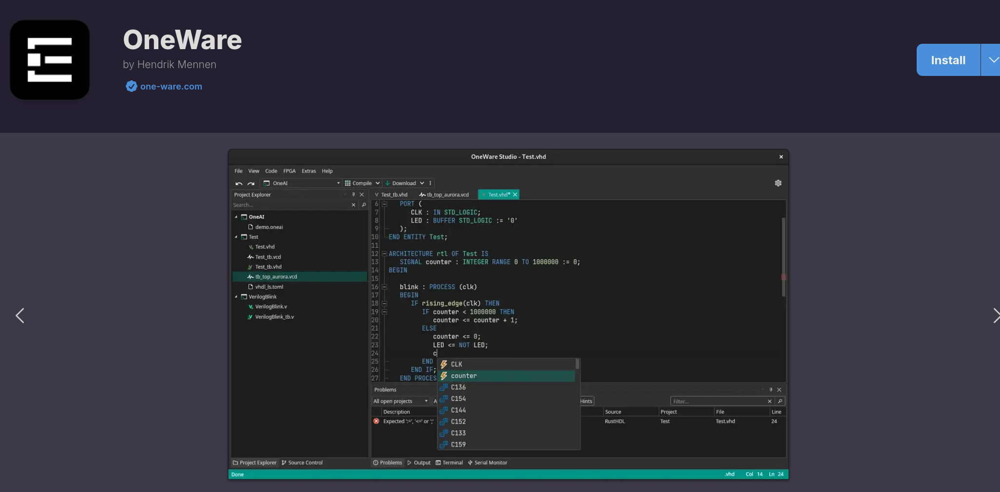

# OneWare Studio: Installation and Usage Guide for Electronics Development

## 1. Installing OneWare Studio on Linux

OneWare Studio is a next-generation IDE for electronics development supporting a broad range of development languages including VHDL, Verilog, C++, and more. It is designed to streamline electronics development with features like a high-speed simulation viewer and advanced debugging tools. Here's how to install it on Linux:

### Method 1: Using Snap (Recommended)

1. Open your terminal
2. Install OneWare Studio using the following command:
   ```bash
   sudo snap install --classic oneware
   ```
3. Verify installation by launching OneWare Studio from your applications menu



### Method 2: Using Flatpak

1. Ensure Flatpak is installed on your system
2. Install OneWare Studio using:
   ```bash
   flatpak install flathub com.one_ware.OneWare
   ```
3. Launch OneWare Studio using:
   ```bash
   flatpak run com.one_ware.OneWare
   ```



### Method 3: Manual Installation

1. Download the .tgz package from the [OneWare GitHub releases page](https://github.com/OneWare/OneWare/releases)
2. Extract the package:
   ```bash
   tar -xzf oneware-linux-x64.tgz
   ```
3. Navigate to the extracted directory and run:
   ```bash
   ./oneware
   ```

## 2. Writing Digital Design Code

### Creating Your First VHDL/Verilog Project

1. Launch OneWare Studio
2. Go to File → New → Project
3. Select "FPGA" or appropriate digital design template
4. Enter a project name and select a location for your project
5. Choose your preferred toolchain (vendor-independent options available)
6. Click "Create"

## 3. Key Features

### Comprehensive VHDL and Verilog Support

OneWare Studio provides extensive support for VHDL and Verilog, including:
- Syntax highlighting
- Code completion
- Error checking
- Navigation tools

### Vendor-Independent FPGA Development

- Support for multiple FPGA vendors
- Standardized project structure
- Unified build system
- Cross-vendor compatibility

### Advanced Simulation Tools

- Integration with GHDL and IVerilog
- High-speed, multithreaded VCD Viewer
- Waveform inspection and analysis
- Timing diagram visualization

### Extensible Architecture

- Custom extensions for additional functionality
- Hardware support plugins
- Language service extensions
- Tool integration framework

### Modern IDE Features

- Integrated Git support
- Dark and light themes
- Split editing
- Multiple workspaces
- Terminal integration
