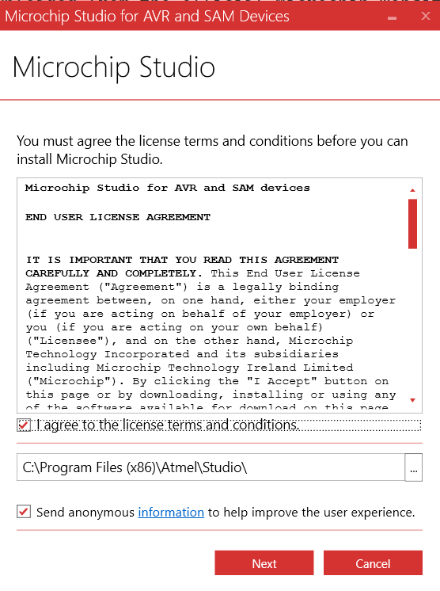
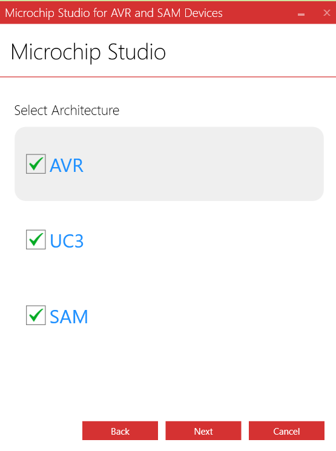

# OneWare Studio: Features and Usage Report for Electronics Development

## 1. Writing Digital Design Code

### Creating Your First VHDL/Verilog Project

1. Launch OneWare Studio
2. Go to File → New → Project
3. Select "FPGA" or appropriate digital design template
4. Enter a project name and select a location for your project
5. Choose your preferred toolchain (vendor-independent options available)
6. Click "Create"

## 2. Key Features

### Comprehensive VHDL and Verilog Support

OneWare Studio provides extensive support for VHDL and Verilog, including:
- Syntax highlighting
- Code completion
- Error checking
- Navigation tools

### Vendor-Independent FPGA Development

- Support for multiple FPGA vendors
- Standardized project structure
- Unified build system
- Cross-vendor compatibility

### Advanced Simulation Tools

- Integration with GHDL and IVerilog
- High-speed, multithreaded VCD Viewer
- Waveform inspection and analysis
- Timing diagram visualization

### Extensible Architecture

- Custom extensions for additional functionality
- Hardware support plugins
- Language service extensions
- Tool integration framework

### Modern IDE Features

- Integrated Git support
- Dark and light themes
- Split editing
- Multiple workspaces
- Terminal integration

## Images

