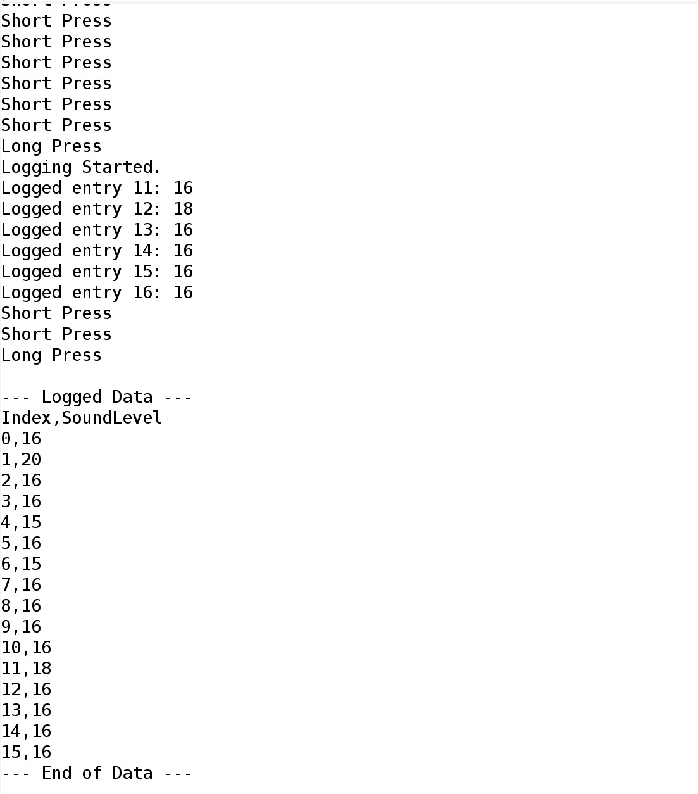

# ESP8266 Sound Level Logger

## Project Overview

This project implements a sound level logger using an ESP8266 microcontroller, a KY-037 microphone sound sensor, and an OLED display. It records sound intensity readings to the ESP8266's internal EEPROM and allows users to view the status, dump data via Serial, and erase stored data.

## Features

-   Real-time display of current sound level (raw ADC value) on OLED.
-   Logging of sound levels to EEPROM at regular intervals.
-   Display of EEPROM usage (number of entries, full status).
-   Menu-driven interface using a single button (built-in IO0) for:
    -   Starting/Stopping data logging.
    -   Dumping all logged data to Serial Monitor in CSV format (Index,SoundLevel).
    -   Erasing all logged data from EEPROM (with confirmation).
-   Button input handling with debouncing and long/short press detection.

## Hardware Components

-   **Microcontroller**: ESP8266 (e.g., NodeMCU, Wemos D1 Mini)
-   **Display**: OLED Display 128x64 pixels, I2C interface (e.g., SSD1306 based on SH1106 or SSD1306 driver chip)
-   **Sound Sensor**: KY-037 Microphone Sound Detection Sensor Module (or similar with analog output)
-   **Input**: Built-in Flash button on ESP8266 development board (GPIO0)
-   **Connecting Wires**

## Circuit Diagram and Connections

### 1. ESP8266 to OLED Display (I2C)
-   OLED SCL/SCK to ESP8266 D1 (GPIO5)
-   OLED SDA to ESP8266 D2 (GPIO4)
-   OLED VCC to ESP8266 3.3V
-   OLED GND to ESP8266 GND

### 2. ESP8266 to KY-037 Microphone Sensor
-   KY-037 AO (Analog Output) to ESP8266 A0
-   KY-037 + (VCC) to ESP8266 3.3V
-   KY-037 G (GND) to ESP8266 GND

### 3. Button
-   The project uses the built-in Flash button (GPIO0) on the ESP8266 development board. No external wiring is needed.

### 4. Power
-   Power the ESP8266 via its USB port.

### Assembly Notes
-   Use a breadboard for easy connections or solder components for a more permanent setup.
-   Keep wires, especially for I2C and analog signals, as short as reasonably possible to minimize noise.
-   Double-check all connections before powering on the ESP8266. Incorrect wiring can damage components.
-   The KY-037 module has a potentiometer to adjust the sensitivity of the digital output (DO). This does not affect the analog output (AO) used in this project.

## Retrieving Logged Data

1.  Connect the ESP8266 to your computer via USB.
2.  Open the Arduino IDE and select the correct COM port (Tools > Port).
3.  Open the Serial Monitor (Tools > Serial Monitor or Ctrl+Shift+M). Set the baud rate to **115200**.
4.  On the device, navigate to the "Dump Data" option in the menu and execute it using a long press.
5.  The logged data will be printed to the Serial Monitor in CSV format:
    ```
    Index,SoundLevel
    0,150
    1,230
    ...
    ```
6.  Copy the data from the Serial Monitor and paste it into a text file (e.g., `data.csv`).
7.  This CSV file can be opened with spreadsheet software (Microsoft Excel, Google Sheets, LibreOffice Calc, etc.).

## Troubleshooting

-   **No Display / Gibberish on OLED:**
    *   Check wiring between ESP8266 and OLED (SDA, SCL, VCC, GND).
    *   Ensure the correct I2C address is used in the code (`0x3C` is common).
    *   Verify OLED VCC is connected to 3.3V.
-   **Button Not Working:**
    *   Ensure you are using the built-in Flash button (GPIO0).
-   **Not Logging / EEPROM Issues:**
    *   Check Serial Monitor for error messages.
    *   The `EEPROM_SIZE` in the code should not exceed ESP8266 capabilities (typically up to 4096 bytes). `EEPROM.begin()` must be called.
-   **Incorrect Sound Readings:**
    *   Ensure KY-037's AO pin is connected to ESP8266 A0.
    *   Check power and ground to KY-037.
-   **Upload Fails:**
    *   Ensure correct board and port are selected in Arduino IDE.
    *   Try holding the Flash/Boot button (GPIO0) while uploading if it fails.
    *   Check USB cable and drivers (CH340/CP210x if applicable).

## Images

